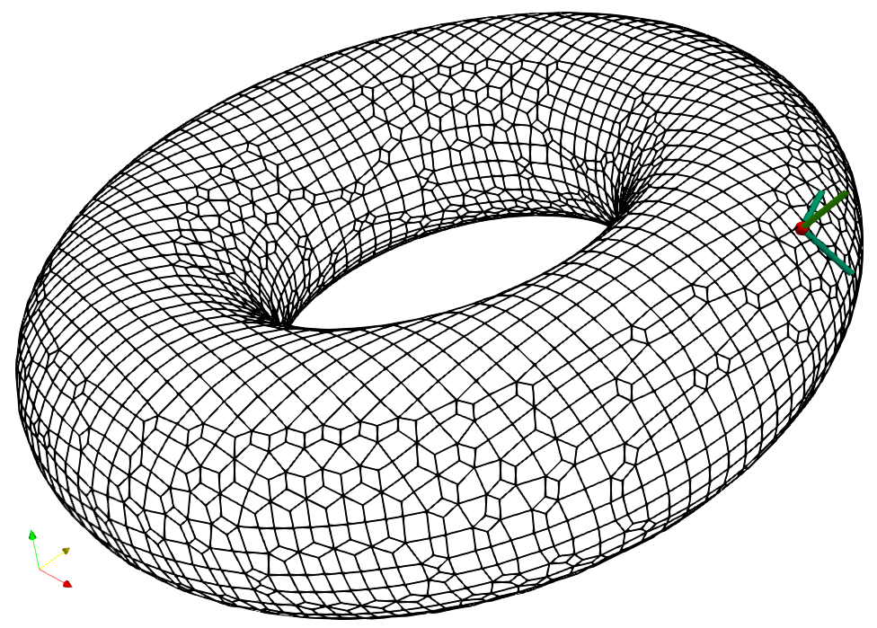

# Implicit Curvatures

Computing mean-, Gaussian and principal curvatures for implicit surfaces,
along with principal directions.

Uses my [geometry library](https://github.com/salvipeter/libgeom/).

## Usage

See the API in the header file, and also the test program (needs my [dual contouring library](https://github.com/salvipeter/dual-contouring)).

Note that the curvature is only defined in regular points;
the program will likely crash when the gradient vanishes.

## References

- [Curvature formulas for implicit curves and surfaces (Goldman, 2005)](https://doi.org/10.1016/j.cagd.2005.06.005)
- [Notes on the curvature tensor (Lehmann & Reif, 2012)](https://doi.org/10.1016/j.gmod.2012.04.003)
- [Computational Assessment of Curvatures and Principal Directions of Implicit Surfaces from 3D Scalar Data (Albin et al., 2017)](https://doi.org/10.1007/978-3-319-67885-6_1)

See also my [writeup on this](https://github.com/salvipeter/weingarten/).
